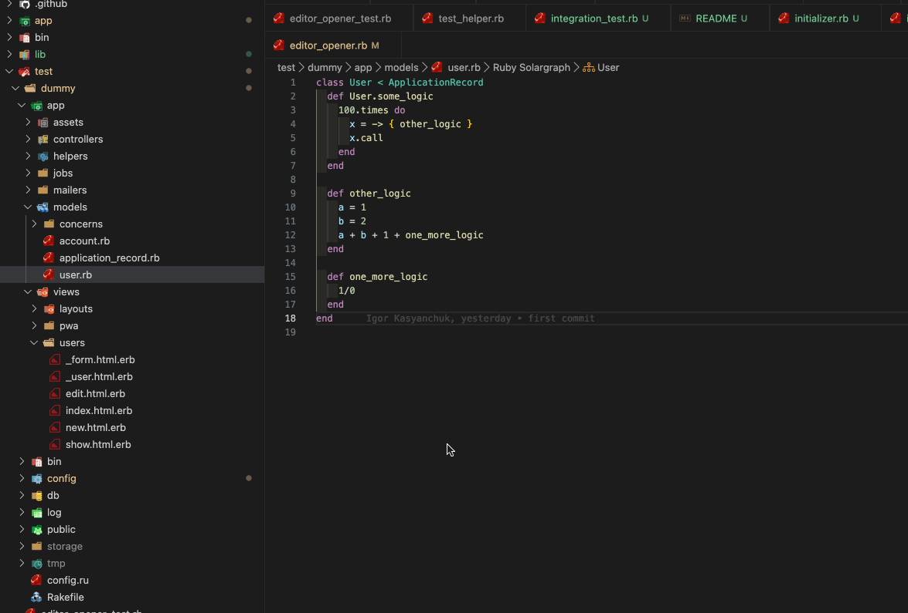

# editor_opener

Open source files in your editor directly from Rails error pages. This gem adds clickable links to file paths in Rails error pages, allowing you to instantly open files at the exact line where errors occur.



## Features

- 🔗 **Clickable file links** in Rails error pages
- 📝 **Multiple editor support** - Works with 13+ popular editors
- 🎯 **Precise line targeting** - Opens files at the exact error line
- 🔧 **Easy configuration** - Set via initializer or environment variable
- 🚀 **Zero configuration** - Works out of the box with `EDITOR` environment variable
- 📱 **Custom URL schemes** - Uses editor-specific protocols for seamless integration

## Installation

Add this line to your application's Gemfile:

```ruby
group :development do
  gem "editor_opener"
end
```

And then execute:
```bash
$ bundle install
```

## Configuration

### Option 1: Generate and configure initializer (Recommended)

```bash
$ rails generate editor_opener:install
```

This creates `config/initializers/editor_opener.rb` with all supported editors listed as comments.

Edit the initializer to set your preferred editor:

```ruby
EditorOpener.setup do |config|
  config.editor = :cursor  # or any other supported editor
end
```

### Option 2: Environment variable

Set the `EDITOR` environment variable:

```bash
export EDITOR=cursor  # for Cursor
export EDITOR=atom    # for Atom
export EDITOR=subl    # for Sublime Text
```

## Usage

1. **Install and configure** the gem (see above)
2. **Restart your Rails server**
3. **Trigger an error** in your Rails application
4. **Click the edit icons** (✏️) or line numbers in the error page to open files in your editor

The gem automatically detects error traces from:
- Application code
- Gem files
- Direct file paths

## Supported Editors

The gem supports the following editors with their respective symbols:

| Editor | Symbols | Protocol |
|--------|---------|----------|
| **Atom** | `:atom` | `atom://` |
| **Cursor** | `:cursor` | `cursor://` |
| **Emacs** | `:emacs`, `:emacsclient` | `emacs://` |
| **IntelliJ IDEA** | `:idea` | `idea://` |
| **MacVim** | `:macvim`, `:mvim` | `mvim://` |
| **Nova** | `:nova` | `nova://` |
| **RubyMine** | `:rubymine` | `x-mine://` |
| **Sublime Text** | `:sublime`, `:subl`, `:st` | `subl://` |
| **TextMate** | `:textmate`, `:txmt`, `:tm` | `txmt://` |
| **Visual Studio Code** | `:vscode`, `:code` | `vscode://` |
| **VSCodium** | `:vscodium`, `:codium` | `vscodium://` |
| **Windsurf** | `:windsurf` | `windsurf://` |
| **Zed** | `:zed` | `zed://` |

## Examples

### Basic Configuration

```ruby
# config/initializers/editor_opener.rb
EditorOpener.setup do |config|
  config.editor = :cursor
end
```

### Environment Variable

```bash
# In your shell profile (~/.bashrc, ~/.zshrc, etc.)
export EDITOR=cursor

# Or in your .env file (if using dotenv)
EDITOR=cursor
```

### Multiple Environments

```ruby
# config/initializers/editor_opener.rb
EditorOpener.setup do |config|
  config.editor = Rails.env.development? ? :cursor : nil
end
```

## How It Works

1. **Error Detection**: The gem overrides Rails error pages
2. **Trace Parsing**: Extracts file paths and line numbers from stack traces
3. **Editor Detection**: Matches configured editor with supported protocols
4. **URL Generation**: Creates editor-specific URLs for file opening
5. **Link Enhancement**: Adds clickable links to error page templates

## Troubleshooting

### Editor doesn't open files

1. **Check editor configuration**: Ensure your editor symbol is correct
2. **Verify protocol support**: Make sure your editor supports URL protocols
3. **Test environment variable**: Try setting `EDITOR` environment variable
4. **Restart Rails server**: Configuration changes require server restart

### Links don't appear

1. **Check gem is loaded**: Ensure gem is in development group
2. **Verify Rails environment**: Gem typically only works in development
3. **Test with simple error**: Create a basic error to test functionality

## Development

After checking out the repo, run:

```bash
$ bin/setup
$ bin/test
```

To run tests:

```bash
$ bin/test
$ bin/rubocop
```

## Contributing

Bug reports and pull requests are welcome on GitHub at https://github.com/igorkasyanchuk/editor_opener.

1. Fork the project
2. Create your feature branch (`git checkout -b my-new-feature`)
3. Make your changes
4. Add tests for your changes
5. Ensure all tests pass (`bin/test`)
6. Commit your changes (`git commit -am 'Add some feature'`)
7. Push to the branch (`git push origin my-new-feature`)
8. Create a new Pull Request

## TODO

- verify it works with old Rails versions
- more tests
- support for more error pages?
- support for more editors

## License

The gem is available as open source under the terms of the [MIT License](https://opensource.org/licenses/MIT).

## Credits

Created by [Igor Kasyanchuk](https://github.com/igorkasyanchuk).

## Related Projects

- [better_errors](https://github.com/BetterErrors/better_errors) - Better error pages for Rails
- [web-console](https://github.com/rails/web-console) - Rails console in your browser
